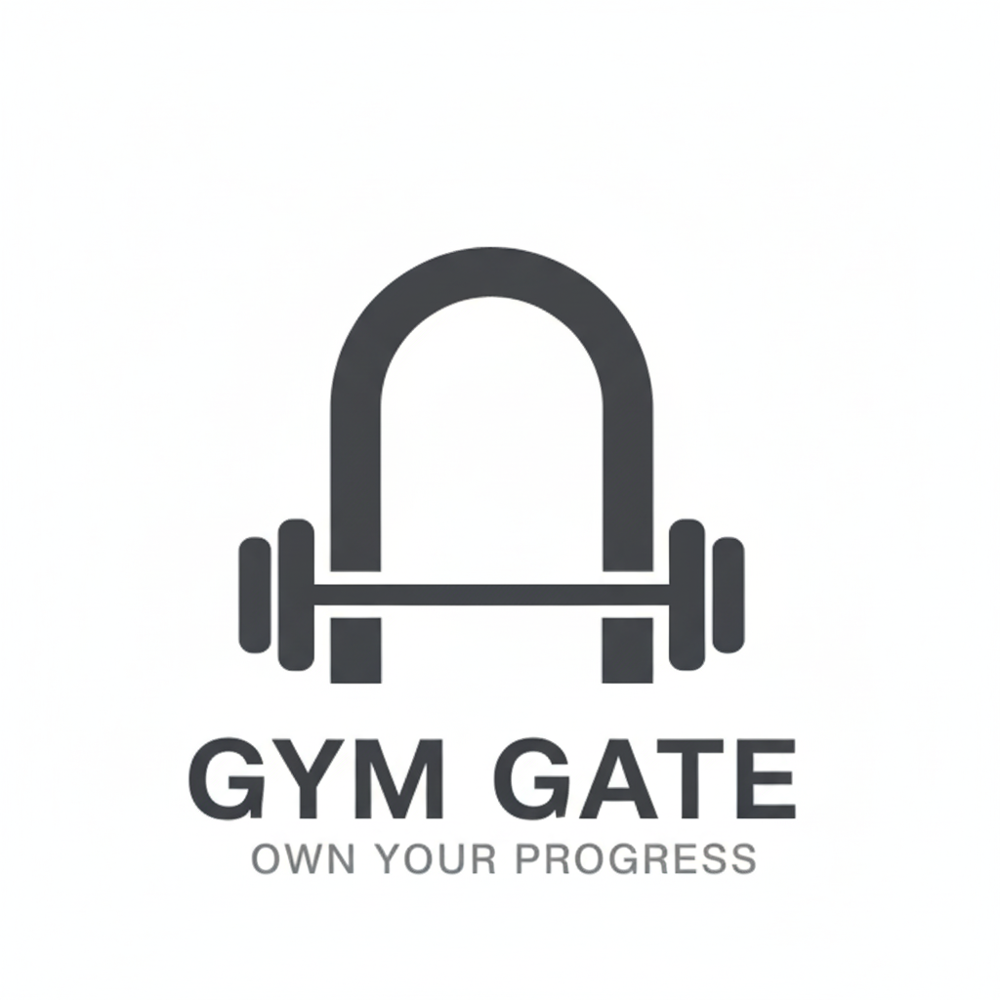
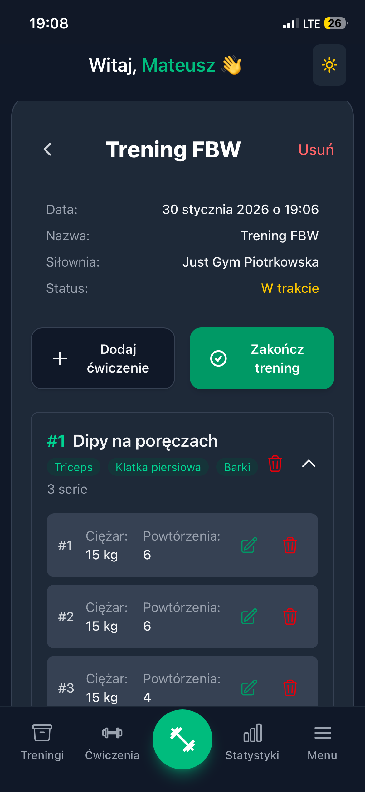
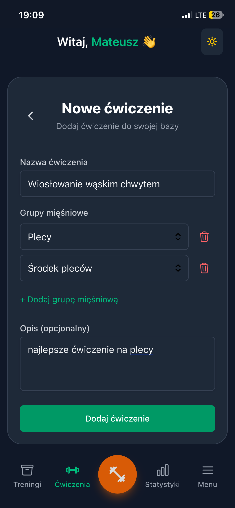
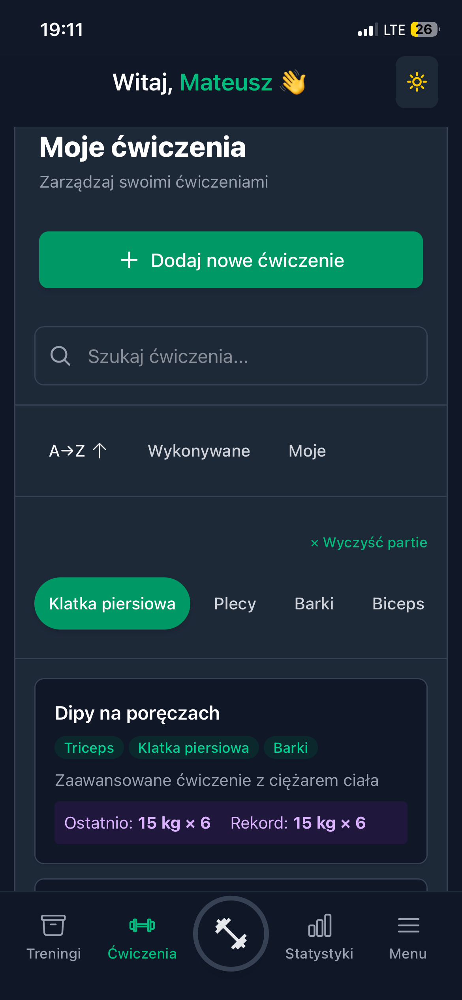

# README

  

# 🏋️ GymGate - Smart Workout Tracking Platform

Platforma do prowadzenia treningów siłowych, zarządzania ćwiczeniami i śledzenia progresu

---

## 🎯 O projekcie

GymGate to nowoczesna aplikacja webowa dla osób trenujących siłowo.  
Pozwala szybko rozpocząć trening, dodawać ćwiczenia i serie oraz zamykać sesję z automatyczną aktualizacją statystyk.

Projekt został zaprojektowany tak, aby działał płynnie także przy niestabilnym połączeniu z internetem.
Dane są przechowywane lokalnie i synchronizowane z serwerem, gdy użytkownik wraca online.

GymGate łączy prostotę codziennego użycia z czytelną architekturą fullstack, dzięki czemu dobrze sprawdza się zarówno jako produkt, jak i jako baza do dalszego rozwoju.

---

## 📸 Podgląd aplikacji

### Ekrany produktu

  
  
  

Powyższe zrzuty pokazują główny przepływ użytkownika: od listy treningów i ćwiczeń, przez edycję serii, aż po podgląd statystyk oraz zarządzanie kontem.

---

## 🚀 Kluczowe funkcje

- 🏁 **Szybki start treningu** – rozpoczęcie sesji w statusie `DRAFT`.
- 🧩 **Budowanie treningu** – dodawanie ćwiczeń, kolejności i notatek.
- 🔢 **Zarządzanie seriami** – waga, powtórzenia, edycja i usuwanie.
- ✅ **Zamknięcie treningu** – przejście do `COMPLETED` z aktualizacją statystyk.
- 📊 **Statystyki ćwiczeń** – rekordy ciężaru, ostatnie wykonanie, liczba treningów.
- 🌐 **Offline-first UX** – lokalny cache + synchronizacja po odzyskaniu sieci.
- 🔐 **Bezpieczne logowanie** – ochrona konta i tras API.

---

## 🔧 Moduły systemu

### 🔐 Authentication Module

- rejestracja i logowanie użytkownika,
- utrzymanie sesji użytkownika,
- endpoint `GET /api/auth/me` do odtwarzania sesji.

### 🏋️ Workout Management Module

- tworzenie i edycja treningów,
- obsługa aktywnego treningu użytkownika,
- zamykanie sesji treningowej i zapis historii.

### 🧠 Exercise Module

- pełny CRUD ćwiczeń,
- grupy mięśniowe i opis ćwiczenia,
- przygotowanie pod rozbudowę biblioteki ćwiczeń.

### 📈 Statistics Module

- statystyki per ćwiczenie (`maxWeight`, `lastWeight`, `totalWorkouts`),
- zbiorczy podgląd progresu użytkownika,
- aktualizacja danych po zakończeniu treningu.

### 🔄 Offline Sync Module

- lokalne przechowywanie danych (IndexedDB),
- optymistyczne aktualizacje interfejsu,
- synchronizacja operacji po powrocie online.

---

## 🛠️ Technologie

### Backend

- **Node.js + Express (TypeScript)** – warstwa API
- **Prisma ORM** – modelowanie i dostęp do danych
- **PostgreSQL** – relacyjna baza danych
- **bcryptjs** – bezpieczne hashowanie haseł
- **Zod** – walidacja danych wejściowych

### Frontend

- **React 19 + Vite + TypeScript** – szybki i nowoczesny UI
- **Tailwind CSS** – warstwa stylowania
- **Context API** – zarządzanie stanem aplikacji
- **IndexedDB (localStore)** – trwały cache lokalny

---

## 🧱 Architektura projektu

### Backend (`backend/`)

- architektura modułowa (`auth`, `user`, `exercise`, `workout`),
- podział na warstwy: `routes -> controller -> service -> repository`,
- centralny punkt startowy: `src/index.ts`,
- model domenowy w `prisma/schema.prisma`.

### Frontend (`frontend/`)

- `AuthContext` – sesja i tożsamość użytkownika,
- `DataContext` – dane domenowe i akcje biznesowe,
- `syncManager` – cykliczny sync i obsługa online/offline,
- komponenty ekranów dla treningów, ćwiczeń i statystyk.

---

## 📡 API (przegląd)

- `POST /api/auth/register`
- `POST /api/auth/login`
- `GET /api/auth/me`
- `GET/POST/PATCH/DELETE /api/exercises`
- `GET/POST/PATCH/DELETE /api/workouts`
- `POST /api/workouts/:workoutId/exercises`
- `POST /api/workouts/items/:itemId/sets`
- `GET /api/workouts/stats/all`
- `GET /api/workouts/stats/exercise/:exerciseId`

Szczegółowa dokumentacja endpointów znajduje się w:

- `backend/src/modules/user/API.md`
- `backend/src/modules/exercise/API.md`
- `backend/src/modules/workout/API.md`

---

## 👥 Autor

**Mateusz Ciołkowski**
