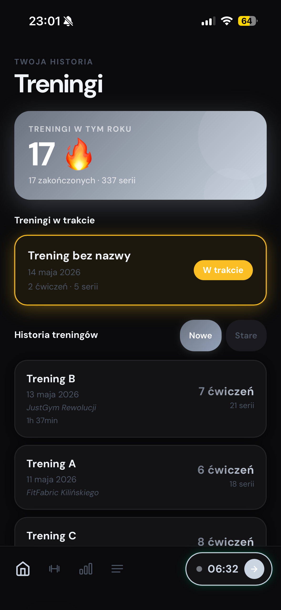
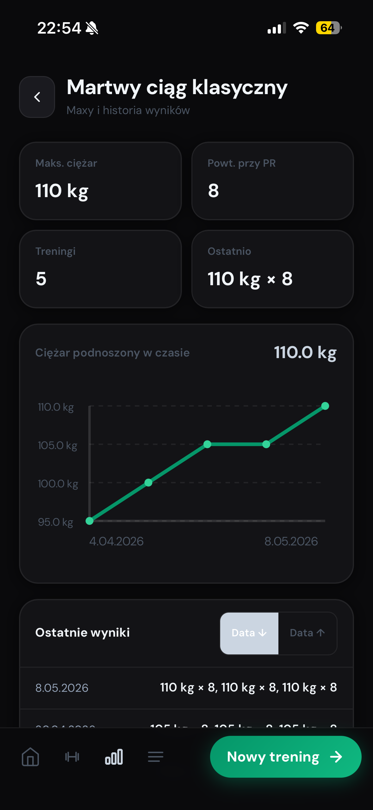

<p align="center">
  
</p>

<h1 align="center">GymGate</h1>
<p align="center">SMART WORKOUT TRACKING PLATFORM</p>

<p align="center">
  <a href="README.md"><strong>English</strong></a> &nbsp;|&nbsp; <a href="README.pl.md">Polski</a>
</p>

<p align="center">
  
  
  
  
  
  
</p>

---

## About

GymGate is a fullstack web application for strength training. It lets you start a session, build workouts by adding exercises and sets, and close the session with automatic statistics updates.

The app is built around an offline-first architecture — all data is persisted locally in the browser and synchronized with the backend in the background. Every user action updates the UI immediately without waiting for a server response.

---

## Screenshots

<p align="center">
  
  &nbsp;&nbsp;&nbsp;&nbsp;&nbsp;
  
  &nbsp;&nbsp;&nbsp;&nbsp;&nbsp;
  
</p>

---

## Features

- **Quick start** — begin a training session in `DRAFT` status with a single tap.
- **Workout builder** — add exercises, reorder them, and attach notes.
- **Set management** — log weight, repetitions, and edit or delete any set.
- **Session completion** — transition to `COMPLETED` with automatic stats rebuild.
- **Exercise statistics** — track max weight, last performance, and total sessions per exercise.
- **Offline-first UX** — optimistic UI updates backed by IndexedDB, synced when back online.
- **Secure authentication** — session management via JWT in an httpOnly cookie.

---

## Technical Design

### Offline-first Architecture

Every mutation follows the same pattern: the UI and local IndexedDB are updated immediately (optimistic update), then the API call is fired in the background. If the server returns an error, the state is rolled back to its previous value.

When the user is offline, write operations are queued in IndexedDB rather than dropped. `syncManager` runs on a periodic interval and flushes the queue as soon as the connection is restored, replaying operations in the original order.

Temporary client-side IDs (`temp_*`) are assigned to new records before the server responds. Once the API confirms the creation, the IDs are remapped across the entire local state — no stale references remain.

### Statistics Engine

`ExerciseUserStats` tracks per-exercise metrics: `maxWeight`, `lastWeight`, `lastReps`, and `totalWorkouts`. Instead of updating these incrementally, the system performs a **full rebuild** by aggregating across all `COMPLETED` workouts whenever relevant data changes — after session completion, workout deletion, or set edits inside a completed session.

This approach trades a small amount of compute for guaranteed consistency: there is no risk of stats drifting out of sync due to partial updates or failed transactions.

### Note Carry-over

When a user adds a note to an exercise during a session, it is upserted into `ExercisePendingNote`. The next time that exercise is added to any workout, the pending note is fetched within a transaction, written to `WorkoutItem.previousNote`, and immediately deleted — consumed exactly once.

### Authentication

JWT is stored in an `httpOnly` cookie, making it inaccessible to JavaScript and protected against XSS. Every protected API route is guarded by auth middleware that validates the token before the request reaches the controller.

---

## System Modules

### Authentication

- User registration and login
- Session persistence via JWT in an httpOnly cookie
- `GET /api/auth/me` for session restoration on page load

### Workout Management

- Create, edit, and delete training sessions
- Active workout tracking per user (only one `DRAFT` session at a time)
- Session closure: transitions to `COMPLETED` and triggers a stats rebuild

### Exercise Library

- Full CRUD for exercises (global seed + user-created)
- Muscle group categorization and descriptions

### Statistics

- Per-exercise stats: `maxWeight`, `lastWeight`, `lastReps`, `totalWorkouts`
- Rebuilt from scratch after every completion, deletion, or set edit
- Aggregated exclusively from `COMPLETED` workouts

### Offline Sync

- All data persisted locally via IndexedDB (`localStore`)
- Optimistic updates with automatic rollback on API failure
- Write queue replayed by `syncManager` on reconnect

---

## Tech Stack

### Backend

| Technology                     | Role                              |
| ------------------------------ | --------------------------------- |
| Node.js + Express (TypeScript) | API layer                         |
| Prisma ORM                     | Data modeling and database access |
| PostgreSQL                     | Relational database               |
| Zod                            | Input validation                  |
| bcryptjs                       | Password hashing                  |

### Frontend

| Technology                   | Role                                |
| ---------------------------- | ----------------------------------- |
| React 19 + Vite + TypeScript | UI framework                        |
| Tailwind CSS                 | Styling                             |
| Context API                  | Global state management             |
| IndexedDB (localStore)       | Local cache and offline persistence |

---

## Architecture

### Backend (`backend/`)

Modular structure with strict layering per module:

```
routes -> controller -> service -> repository
```

Modules: `auth`, `user`, `exercise`, `workout`. Entry point: `src/index.ts`. Domain model defined in `prisma/schema.prisma`.

### Frontend (`frontend/`)

- `AuthContext` — session and user identity
- `DataContext` — domain data and business actions (single global store)
- `syncManager` — periodic sync and online/offline handling
- Screen components for workouts, exercises, and statistics

---

## API Overview

```
POST   /api/auth/register
POST   /api/auth/login
GET    /api/auth/me

GET    /api/exercises
POST   /api/exercises
PATCH  /api/exercises/:id
DELETE /api/exercises/:id

GET    /api/workouts
POST   /api/workouts
PATCH  /api/workouts/:id
DELETE /api/workouts/:id

POST   /api/workouts/:workoutId/exercises
POST   /api/workouts/items/:itemId/sets

GET    /api/workouts/stats/all
GET    /api/workouts/stats/exercise/:exerciseId
```

Full endpoint documentation:

- [`backend/src/modules/user/API.md`](backend/src/modules/user/API.md)
- [`backend/src/modules/exercise/API.md`](backend/src/modules/exercise/API.md)
- [`backend/src/modules/workout/API.md`](backend/src/modules/workout/API.md)

---

## Author

**Mateusz Ciolkowski**
